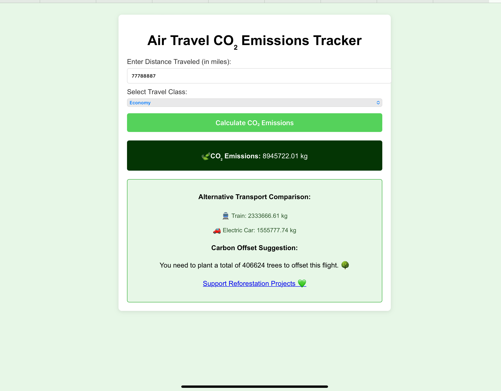
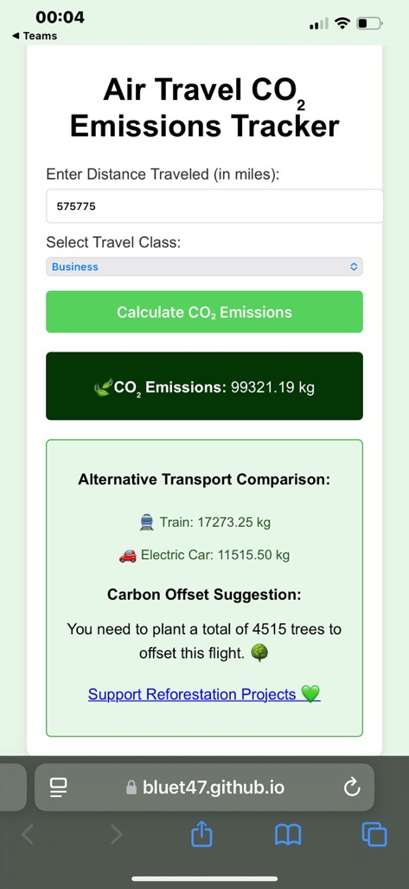

# sustainability-tracker
 Click here to see [Sustainability Tracker - Air Travel](https://bluet47.github.io/co2-tracker/)

## Summative 1: Report (Workplace Case Study) ##

Sustainability Tracker - Air Travel

For the purpose of this assignment, I will refer to my employer as XYZ to maintain anonymity. The Sustainability Tracker - Air Travel has been deployed using GitHub Pages.

## Product Overview ##
At XYZ, our core values guide everything we do, with one of the most important being "We do the right thing." With this in mind, XYZ has set an ambitious goal of becoming net zero by 2030. As part of this commitment, we designed and developed a web application to track the carbon emissions from business trips, helping us understand the environmental impact of our travel activities.
This application serves two primary purposes: as a corporate responsibility tool to monitor emissions and as a means of raising awareness and encouraging individuals and teams to make more sustainable choices. Business travel is a significant contributor to XYZ's carbon footprint. To address this, employees are now required to submit their expected carbon emissions for air travel. This allows managers to assess whether travel is necessary and determine which employees need to travel, helping to reduce overall emissions. Teams are also given an annual carbon usage cap to ensure responsible travel.
Additionally, the application helps managers make informed decisions about the most sustainable locations for meetings and workshops, further minimizing the collective carbon footprint. The application also supports reforestation initiatives, contributing to our broader environmental efforts.

## Installation / Use ##

The application can be accessed in two ways:
### Option 1: Cloud-based Usage ###
This solution is hosted on GitHub Pages, and it can be accessed here: Sustainability Tracker -Air travel . There are no prerequisites for using this option.
### Option 2: Local Installation ###
If you wish to run the application locally, for instance, to make adjustments specific to your team, there are a few prerequisites:

### Prerequisites ###
•	Node.js
•	npm (Node Package Manager)
•	A modern web browser (e.g., Chrome, Firefox, Edge)

### Installation (Linux) ###
1.	Check if Node.js is installed:
Run the following command to verify if Node.js is installed:
node -v
This should print the version number (e.g., v0.10.35).
If Node.js is not installed, visit the official Node.js website to download the latest long-term supported version.

2.	Check npm version:
Run the following command to verify if npm is installed:
npm -v
If npm is installed correctly, it will return a version number. If not, follow the Node.js installation steps.

3.	Clone the Repository:
You can clone the repository using either SSH or HTTPS:
o	SSH:
git clone git@github.com:Bluet47/sustainability-tracker.git
o	HTTPS:
git clone https://github.com/Bluet47/sustainability-tracker.git

4.	Install Dependencies:
Navigate to the project directory and install the required dependencies:
npm init -y
npm install --save-dev jest

### Running Locally ###
1.	To run the application locally, open index.html. This can be done by opening the file directly from your folder or using a development environment with an option to open it with a live server.

### Running on the Cloud ###
To use the cloud version, simply click here: Sustainability Tracker -Air travel

## How to Use ##
When booking flights, enter the following details:
Miles: Enter the number of miles for the flight (e.g., London Heathrow to New York JFK is 3,440 miles).
Class: Select the class of travel (e.g., Business).
Click the green "Calculate CO2 Emissions" button to calculate the carbon emissions for the flight.
This will help you monitor and reduce the carbon impact of your business travel.

## Product Management and Delivery ##
For this project, I chose to implement the Agile framework, particularly due to the project's size, with myself being the sole team member and the varied requirements that needed to be addressed. Kanban was the best fit for the project because of its flexibility.
Using the Agile framework allowed the project to focus on delivering value early, improving incrementally, and prioritizing the most important features first. This approach ensured that stakeholder needs were captured and addressed effectively. Compared to Sprint-based methodologies, Kanban offered greater flexibility, enabling daily feedback and fostering continuous integration and continuous deployment.
The project was divided into two iterations. The first iteration centred on building the Minimum Viable Product (MVP), which was managed using Agile tools. 

Each feature involved the following steps:
Writing tests
Designing features
Coding
Testing
Deploying/Integrating with the overall program

These tasks were grouped under an epic. For the MVP, 2 epics were completed. The second release added two additional epics to include the new features.

 The Kanban board was used to organize tasks into categories for better project management. On my Kanban board, I had four columns: Backlog, In Progress, In Review, and Done. This helped maintain clear visibility of tasks and ensured smooth transitions between stages.

Example of tickets from the a iteration

### Ticket Management ###
Each ticket was defined with a "Definition of Done" to ensure that all functional and non-functional requirements were met before moving forward. This clarity allowed the developer (myself) to track progress and ensure quality.
The tickets also included User Stories and Acceptance Criteria to guide the development process and validate that each feature met the outlined requirements. For features with more complex requirements, I broke them down into smaller sub-tickets, ensuring each step was clear and manageable.

A naming convention was used for tickets to indicate their interconnections and dependencies. This helped me understand the correct order of tasks and ensured that if I collaborated with other developers, they would have a clear visibility of what had been completed and what tasks they needed to pick up next. This systematic approach streamlined the development process and maintained an efficient workflow throughout the project.

Another type of ticket that I would be keen to specifically was issues/bugs. When certain aspects of the code were not functioning properly, I created tickets and  categorised them under the "bug" label. In each bug ticket, I clearly described the issue, including the symptoms of the problem and my initial thoughts on what might be causing it. I also documented the steps I had already taken to attempt a solution, ensuring that we wouldn’t repeat the same troubleshooting efforts. Additionally, I provided possible solutions to try, helping to guide the process toward resolving the issue efficiently.

## Technical Documentation ##
After speaking to our Customers, we broke down their requirement into functional and non-nonfunctional requirements creating a simplified which was the basis of creating user stories and a acceptance criteria  
Functional Requirements:

Non-functional Requirements:

Design 
During this phase, we explored the possible system architecture and UX design would look like 
Based on the identified features, we designed the system architecture. The architecture ensured scalability and flexibility, with the understanding that the product would evolve after feedback from real users.
In this project, we utilized a modern tech stack, focusing on the use of Git and GitHub Pages. GitHub Pages was employed to host the static content, offering a free, reliable hosting platform. The tech stack included HTML, CSS, and JavaScript for front-end development, with a static site HTML generator.  We also made use of Node.js and npm for dependency management and build processes. We also decided we would use GitHub Actions to set up for continuous integration and deployment, automating the workflow from code commits to deployment.

As previously mentioned, this product went through two iterations, which is also reflected in the design process. The first iteration focused on creating the minimal viable product (MVP), and the customer was satisfied with the outcome. However, with the introduction of additional requirements in the second iteration, we had to undergo another design cycle to accommodate these new features. This phase involved refining the design further, ensuring the added functionalities aligned with both the customer’s needs and the overall product vision.

The user interface and experience (UI/UX) design were then focused on the most essential interactions. We aimed to make the design simple, intuitive, and easy to navigate.

Iteration 2

Take a look at the figma design [here](https://www.figma.com/design/XmDw5VaaAg6j9n2joslTLa/Untitled?node-id=0-1&t=SVhHVy28LsZcVihZ-1)

## Development ##
The development of this product followed a Test-Driven Development (TDD) approach, based on the red-to-green cycle. For each epic, we would first scope out the requirements and write the unit tests. Since there was no code at this point, the tests would initially fail. As we developed the code, we wrote just enough to make the tests pass, moving to the "green" stage. We then refactored the code and repeated the cycle until we had a full suite of unit tests with corresponding, working codes. This iterative process allowed us to ensure the code was both functional and well-tested throughout development.

### Branch strategy ###
Using Git and platforms like GitHub, we adopted an agile approach with a branch strategy. The main branch was treated as the source of truth, and we used a development branch to deploy the code, creating pull requests and merging them once they passed all relevant tests. This was enforced by the branch protection rules we set up that ensure you can not directly push to the main branch. This ensured that the codebase was always stable and aligned with the product's core objectives. If the team grow we would further implement this by adding approvals to mergers.

## Implementation: ##

I began the development process locally, starting with the core files of my application—HTML, CSS, and JavaScript. Once I had the basic structure in place, I pushed the initial code to my repository.
Next, I set up the testing pipeline, ensuring that any subsequent code pushed to the repository would automatically trigger the test suite to run. 

However, when I added a dependency to the pipeline, I realized that it was running unit tests on the pipeline itself. To resolve this, I adapted the pipeline to ignore changes to itself, ensuring that updates to the pipeline wouldn't trigger unnecessary tests.

After building and adding more features, I pushed the changes and then set up the publishing workflow. This workflow allowed me to test the application directly in the browser while still actively developing, ensuring continuous feedback throughout the process.

## Testing ##
For each core functionality, unit tests were written to ensure that the code behaved as expected. Tests were written before the code itself, as per the TDD methodology, and these tests were used to validate the MVP functionality.
We set up continuous integration (CI) pipelines to automatically run the unit tests with each code commit, ensuring that no new changes introduced regression.

After the MVP was built, the application went through a series of test including application , performance and UAT testing where  a group of internal testers and early-stage users validated the product. 
The accessibility and performance test scores were all positive, with each domain receiving a score above 90. The performance score of 100 indicates that the website responds quickly, demonstrating efficiency and optimization across browsers, which ensures a great user experience. The SEO  score of 91 suggests that the site is well-optimized for search engines, though there is potential for this to be worked on as a  future improvement .

## Evaluation ##
This project demonstrates a highly efficient and cost-effective approach to building and deploying a CO2 emissions tracker using GitHub Pages for hosting. By leveraging GitHub Pages, the project benefits from free, scalable hosting, which makes it an excellent choice for low-cost and easily deployable web applications. The use of CI/CD pipelines for continuous integration and deployment significantly streamlines the testing and delivery process, ensuring that any changes are automatically tested and deployed without manual intervention. This approach mirrors modern software development practices and can easily be adopted in a workplace environment to enhance development speed and reduce manual errors. Which I will be taking these learnings into my role.

The project is structured around clear functional and non-functional requirements, ensuring it meets stakeholder needs effectively. The app calculates CO2 emissions, provides alternative transport options, and even offers a tree offset suggestion, fulfilling all critical functional requirements. Additionally, non-functional requirements like user experience, compatibility, and performance were given careful attention, ensuring the app is intuitive, responsive, and compatible with various devices and browsers.
The testing process, which follows best practices like unit testing ensures that all features are reliable before deployment. This helps identify bugs early, improving the overall stability of the app and ensuring a better user experience. The successful integration of these testing processes, along with automated deployment through the CI/CD pipeline, would be directly applicable in the workplace to streamline the software development lifecycle.

Areas for Improvement:
While the project has met all the customer requirements there are some areas for improvement.  Working with different testing frameworks could improve the flexibility and coverage of tests, ensuring more thorough validation.
Another area for improvement is the user interface. While functional, the interface could benefit from more advanced features, such as customizable settings or a more visually engaging display of emission comparisons. Enhancing accessibility further to meet all WCAG guidelines would also help improve the inclusivity of the app.

